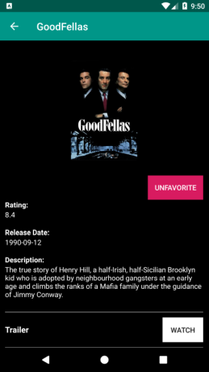
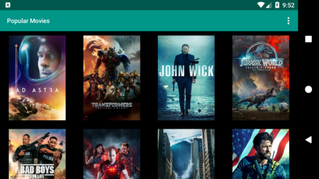

# Popular Movies Stage 2

This is the third project in Udacity's Android Developer Nanodegree.

This app leverages The Movie DB (TMDb) API to pull movie data. The app itself allows the user to poll movies by popularity, rating, and also by the user's favorites. For my implementation, I utilized Android's Room Database capabilities as well as other Android Architecture Components such as LiveData to only query and update the UI when necessary. Other Android concepts touched upon in this implementation are responsive design, as this is the first project where a landscape (tablet) layout was necessary.
